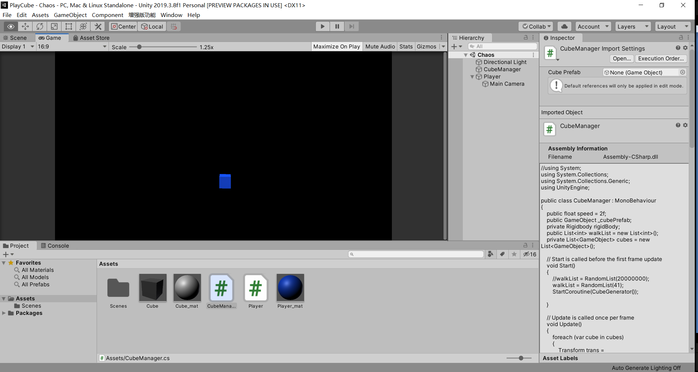

# A Cube Game

## For the Love of Cubes

## Practice With Unity In C#

Version: Visual Studio 2019, Unity 2019.3.8f1

Control System:

use 'w', 'a', 's', 'd' to move the cube vertically and horizontally.

use 'left arrow', 'right arrow', 'up arrow', 'down arrow' to rotate the cube.

Have fun. Thanks.

